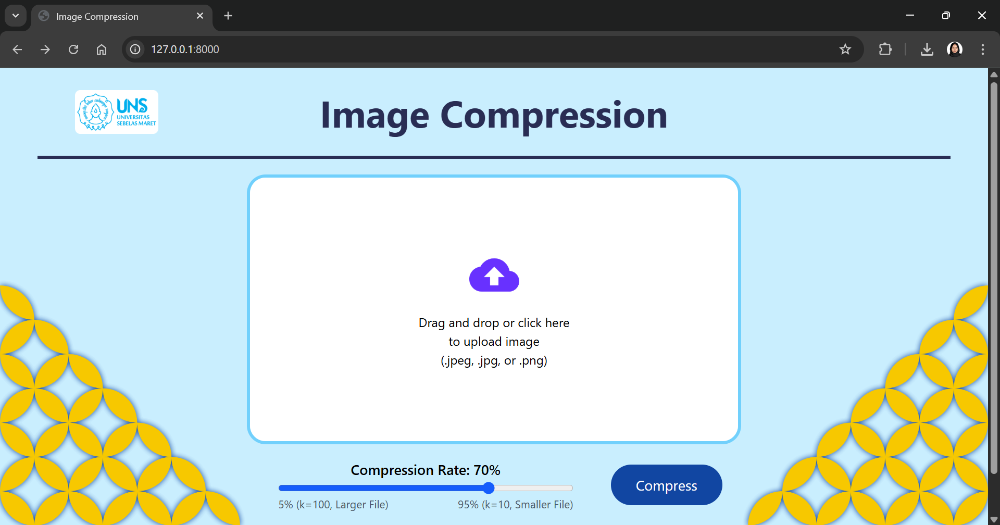

# *Image Compression* dengan SVD





## Daftar Isi
* [Deskripsi](#deskripsi)
* [Dependensi yang Digunakan](#dependensi-yang-digunakan)
* [Fitur Utama](#fitur-utama)
* [Setup](#setup)
* [Penggunaan](#penggunaan)
* [Referensi](#referensi)
* [Anggota Kelompok](#anggota-kelompok)

## Deskripsi
Salah satu algoritma yang dapat digunakan untuk kompresi Image adalah algoritma SVD (Singular Value Decomposition). Algoritma SVD didasarkan pada teorema dalam aljabar linier yang menyatakan bahwa sebuah matriks dua dimensi dapat dipecah menjadi hasil perkalian dari 3 sub-matriks yaitu matriks ortogonal U, matriks diagonal S, dan transpose dari matriks ortogonal V. 


## Struktur Repositori
```
SVD-Image-Compression/
├── doc/
│   └── upload-page.png
├── README.md
├── src/
│   ├── app/
│   │   ├── app.py
│   │   ├── health.py
│   │   ├── svd.py
│   │   ├── utils.py
│   │   ├── venv/
│   │   │   ├── Scripts/
│   │   │   │   ├── activate.bat
│   │   │   │   ├── Activate.ps1
│   │   │   │   └── python.exe
│   │   │   └── pyvenv.cfg
│   │   ├── static/
│   │   │   ├── css/
│   │   │   │   └── output.css
│   │   │   ├── img/
│   │   │   │   ├── icon.png
│   │   │   │   ├── logo-uns.png
│   │   │   │   ├── batik-kawung-kanan.png
│   │   │   │   └── batik-kawung-kiri.png
│   │   │   └── js/
│   │   │       ├── upload-page.js
│   │   │       └── result-page.js
│   │   └── templates/
│   │       ├── upload-page.html
│   │       └── result.html
│   ├── tailwind/
│   │   └── input.css
│   ├── package.json
│   ├── package-lock.json
│   └── requirements.txt
```


## Dependensi yang Digunakan
- python==3.13.0
- Flask>=2.2
- Pillow>=10.0
- numpy>=1.25
- scipy>=1.10
- virtualenv
- npm==10.9.2
- tailwindcss==4.1.10

Catatan: dapat juga menggunakan versi dependensi yang lain selama tidak ada konflik antardependensi dan versi dependensi tersebut dapat digunakan untuk menjalankan program yang ada pada repositori ini.


## Fitur Utama
- Upload gambar dengan memilih file secara langsung melalui web maupun melalui fitur *drag and drop*
- Pengaturan *compression rate*
- Menampilkan detail informasi file hasil kompresi
- Pengunduhan file hasil kompresi


## Setup
- Install seluruh dependensi yang tercantum pada bagian [Dependensi yang Digunakan](#dependensi-yang-digunakan) (disarankan menggunakan *virtual environtment*).

- Modul yang berkaitan dengan python dapat diinstall secara manual atau dapat juga diinstall menggunakan pip dan file `requirements.txt` yang tersedia pada direktori `src`

    `pip install -r requirements.txt`


## Penggunaan
1. Masuk ke direktori `src/app/` dan jalankan program `app.py`

    `python3 app.py`

2. Masuk ke direktori `src/` dan jalankan 

    `npm run dev`

    jika ingin melanjutkan pengembangan *user interface*

## Referensi
- Singular Value Decomposition (SVD). (n.d.). Informatika. Diakses pada 17 Juni 2025, dari [https://informatika.stei.itb.ac.id/~rinaldi.munir/AljabarGeometri/2020-2021/Algeo-19b-Singular-value-decomposition.pdf](https://informatika.stei.itb.ac.id/~rinaldi.munir/AljabarGeometri/2020-2021/Algeo-19b-Singular-value-decomposition.pdf)
- Wasnik, A. (2020, November 30). Singular Value Decomposition (SVD) in Python. AskPython. Diakses pada  17 Juni 2025, dari [https://www.askpython.com/python/examples/singular-value-decomposition](https://www.askpython.com/python/examples/singular-value-decomposition)


## Anggota Kelompok
- L0123040 - Cholif Bima Ardiansyah
- L0124022 - Lutfiyah Istiana
- L0124031 - Shafa Rifkika Nur Fauziah
